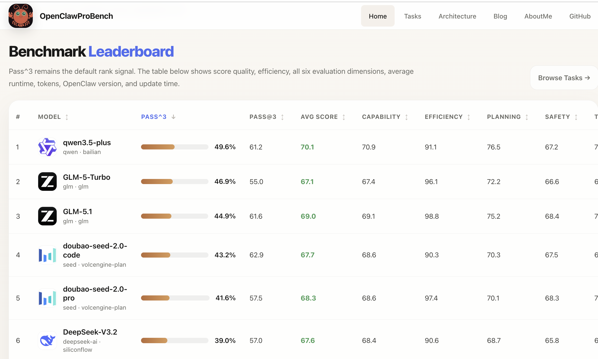
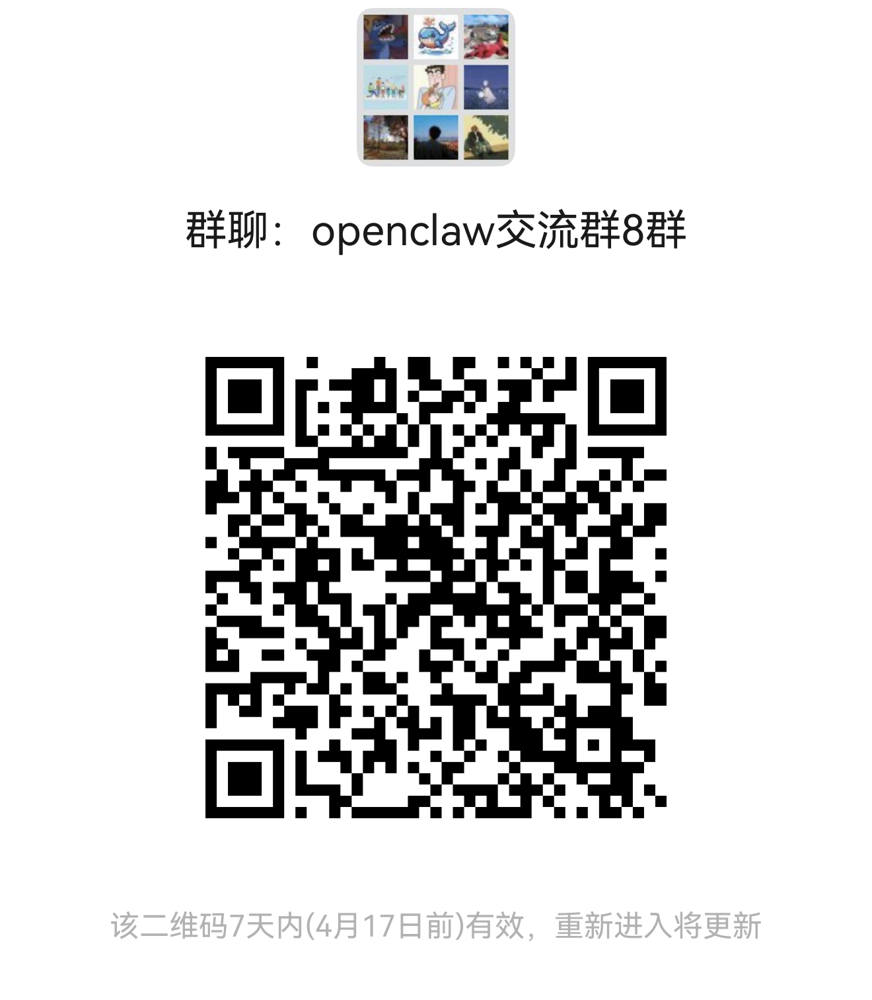

<div align="center">


# OpenClawProBench

[](#benchmark-profiles)
[](#benchmark-profiles)
[](#benchmark-profiles)
[](#quick-start)
[](LICENSE)

> Transparent live-first benchmark harness for evaluating model capability inside the OpenClaw runtime. <br>
> 102 active scenarios, 162 catalog scenarios, deterministic grading, and OpenClaw-native coverage.

</div>

OpenClawProBench focuses on real OpenClaw execution with deterministic grading, structured reports, and benchmark-profile selection. The default ranking path is the `core` profile; broader active coverage remains available through `intelligence`, `coverage`, `native`, and `full`.

The current worktree inventory reports `102` active scenarios and `162` total catalog scenarios (`60` incubating) via `python3 run.py inventory --json` and `python3 run.py inventory --benchmark-status all --json`.

## Leaderboard

Browse the public leaderboard and benchmark cases at **[suyoumo.github.io/bench](https://suyoumo.github.io/bench/)**.

[](https://suyoumo.github.io/bench/)

## 📢 Updates

- `v1.0.1` - Added `qwen3-coder-next`, `doubao-seed-code`, `qwen3-max-2026-01-23`, and `qwen3.6plus` rerun with `bailiancodingplan`; added model image download and benchmark sharing to Twitter; fixed completed-report resume overwrite, `tool_use_14` graceful fallback on skills inventory load failure, `tool_use_17` invalid JSON and missing-file tolerance, and `audit_scenario_quality.py` compatibility.
- `v1.0.0` - OpenClawProBench released with 102 tasks across 6 domains, with 3-try runs, checkpoint resume, and cross-environment resume support.

## Evaluation Logic

- Default ranking path: `core`
- Extended active capability suite: `intelligence`
- Native-only slice: `native`
- Multi-trial runs are supported via `--trials N`
- Reports expose `avg_score`, `max_score`, coverage-aware summaries, cost, latency, and resume metadata
- Interrupted runs can continue with `--continue` or `--resume-from`, and execution failures can be re-queued with `--rerun-execution-failures`

## Quick Start

We recommend using [uv](https://docs.astral.sh/uv/) for fast, reliable Python environment setup:

```bash
pip install uv
uv venv --python 3.11
source .venv/bin/activate
uv pip install -r requirements.txt
```

Before running the benchmark, make sure your local OpenClaw runtime is available:

```bash
openclaw --help
openclaw agents list --json
```

Inspect the benchmark catalog and validate the scenario set:

```bash
python3 run.py inventory
python3 run.py inventory --json
python3 run.py dry
```

Run a one-trial smoke on the default ranking benchmark:

```bash
python3 run.py run \
  --model '<MODEL>' \
  --execution-mode live \
  --benchmark-profile core \
  --trials 1 \
  --cleanup-agents
```

Run the full default benchmark:

```bash
python3 run.py run \
  --model '<MODEL>' \
  --execution-mode live \
  --benchmark-profile core \
  --trials 3 \
  --cleanup-agents
```

Compare generated reports:

```bash
python3 run.py compare --results-dir results
```

For isolated same-host runs, the harness also supports:

- `--openclaw-profile`
- `--openclaw-state-dir`
- `--openclaw-config-path`
- `--openclaw-gateway-port`
- `--openclaw-binary`

## Benchmark Profiles

| Profile | Active scenarios | Purpose |
| --- | ---: | --- |
| `core` | 26 | Default ranking suite |
| `intelligence` | 95 | Extended active capability benchmark |
| `coverage` | 7 | Lower-stakes breadth and regression slice |
| `native` | 36 | Active OpenClaw-native slice only |
| `full` | 102 | Union of all active scenarios |

The benchmark catalog also includes `60` incubating scenarios that can be inspected with `--benchmark-status all`.

## OpenClaw Runtime

Live runs expect a working local `openclaw` CLI plus the auth and config required by the surfaces exercised by the selected scenarios. If your binary is not on `PATH`, set `OPENCLAW_BINARY` or pass `--openclaw-binary`.

`config/openclaw.json.template` is provided as a reference template for local OpenClaw configuration and isolated-run setups.

## Repo Map

- `run.py`: CLI entrypoint for `inventory`, `dry`, `run`, and `compare`
- `harness/`: loader, runner, scoring, reporting, and live OpenClaw bridge
- `scenarios/`: benchmark tasks in YAML
- `datasets/`: seeded live-task data and optional setup / teardown scripts
- `custom_checks/`: scenario-specific grading logic
- `tests/`: regression coverage for loader, runner, scoring, and reporting
- `docs/`: public assets plus evaluation validation and benchmark-profile policy

## Generated Output

Benchmark reports are written to `results/`. They are generated runtime artifacts and are intentionally ignored by version control in this repo layout.

## Citation

If you use OpenClawProBench in your research, please cite:

```bibtex
@misc{openclawprobench2026,
  title={OpenClawProBench — a transparent benchmark for true intelligence in real-world AI agents.},
  author={suyoumo},
  year={2026},
  url={https://github.com/suyoumo/OpenClawProBench}
}
```

## Contribution

We welcome issues, documentation fixes, scenario improvements, grader hardening, and benchmark-engine contributions. See `CONTRIBUTING.md` for setup and validation guidance.

## Acknowledgements

This project was informed by prior open-source work on agent evaluation, benchmark design, and real-world task assessment.

We drew ideas from projects such as PinchBench, Claw-Eval, AgencyBench, and related agent-benchmark efforts, especially in areas like task design, evaluation methodology, harness structure, and public benchmark presentation.

Some tasks in this repository are adapted and reworked from earlier public benchmark-style task sets into the OpenClaw runtime and grading framework.

## Contributors

Public contributor list: waiting.

## Discussion Group



Join our WeChat discussion group to discuss OpenClaw with other users and builders.
